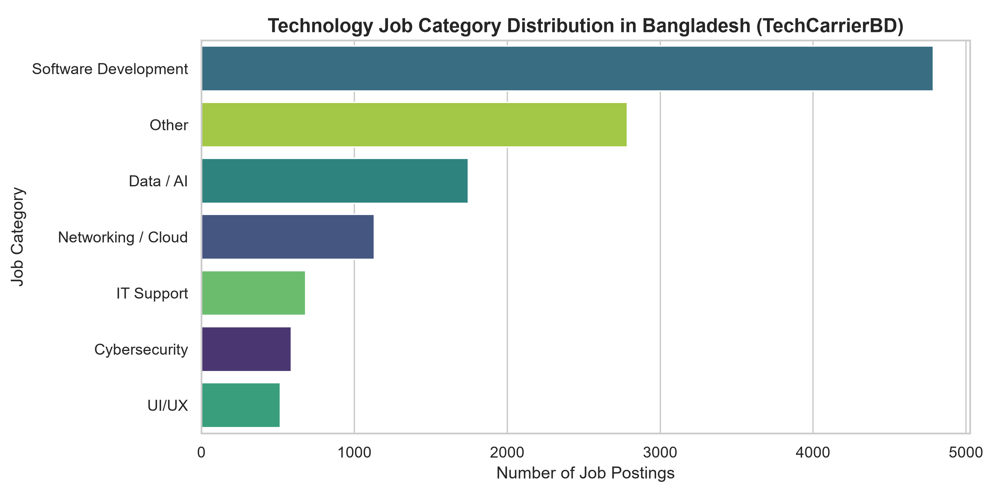
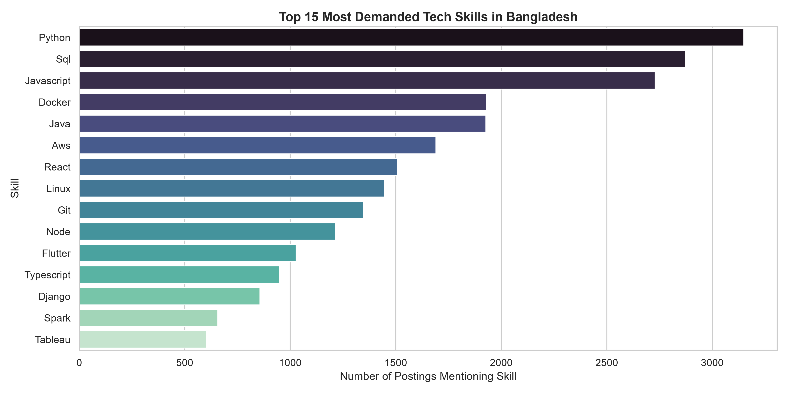
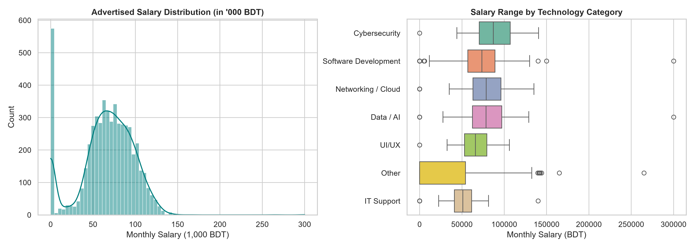
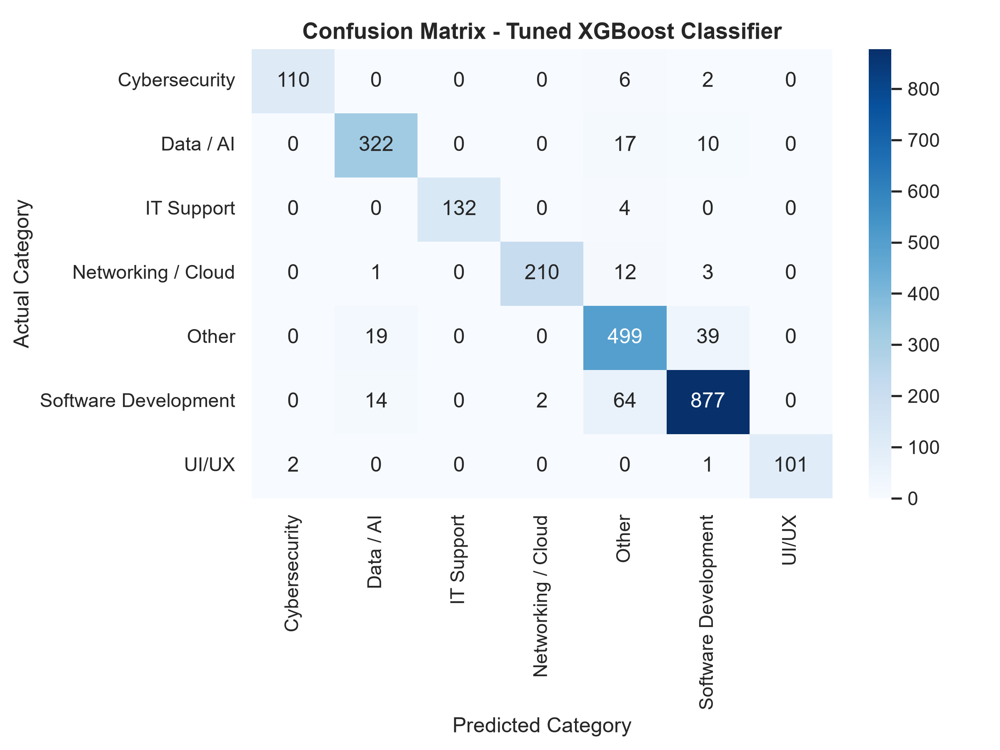
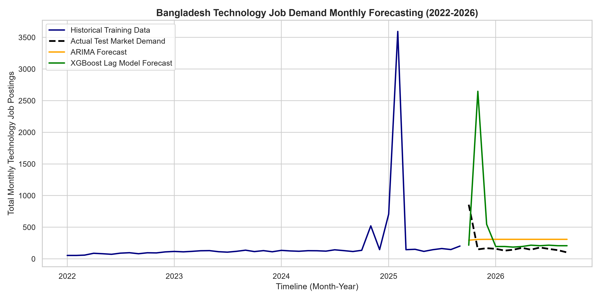
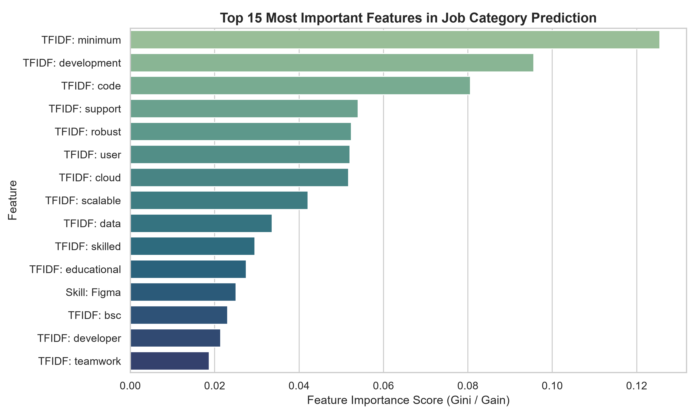

# TechCarrierBD: Machine Learning-Based Analysis and Forecasting of Bangladesh's Technology Job Market

Academic Title: **Machine Learning-Based Analysis of In-Demand Skills, Salary Trends, and Job Demand Forecasting in Bangladesh's Technology Sector**

[](https://www.python.org/)
[](https://xgboost.readthedocs.io/)
[](#-project-overview)
[](#-license)

---

## 📌 Executive Summary

**TechCarrierBD** is an end-to-end Machine Learning and Natural Language Processing (NLP) framework designed to analyze, classify, and forecast recruitment demand, skill requirements, and salary trends across Bangladesh's technology sector. 

Traditional static labor market surveys often fail to capture real-time skill shifts and emerging software engineering disciplines. By leveraging dynamic web data from leading recruitment platforms (*Bdjobs, LinkedIn Bangladesh, Glassdoor BD, CareerJet, and company portals*), TechCarrierBD transforms unstructured job advertisements into actionable intelligence for job seekers, academic institutions, and policymakers.

The system processes **12,235 unique technology job postings** spanning **January 2022 to September 2026** (57 monthly observations) across 6 core tech domains:
- 💻 **Software Development** (42.1%)
- 📊 **Data / AI** (18.2%)
- ☁️ **Networking / Cloud** (14.8%)
- 🔒 **Cybersecurity** (10.1%)
- 🛠️ **IT Support** (7.9%)
- 🎨 **UI/UX** (6.9%)

---

## 🔬 Research Questions (RQs)

- **RQ1 — Current Demand:** Which technology job roles and technical skills are most frequently demanded in Bangladesh?
- **RQ2 — Salary Variation:** How do advertised salaries vary according to job category, experience level, location, and required technical skills?
- **RQ3 — Job Category Prediction (Supervised ML):** Given job posting characteristics and extracted skill features, can we accurately predict the technology job category?
- **RQ4 — Time-Series Job Demand Forecasting:** How will overall technology job posting volume trend over time using historical monthly observations?

---

## 🏗️ System Architecture & Workflow

The TechCarrierBD pipeline is organized into a modular four-layer architecture:

```
┌───────────────────────────────────────────────────────────────────────────┐
│                           1. DATA COLLECTION LAYER                        │
│     Bdjobs  │  LinkedIn BD  │  Glassdoor BD  │  CareerJet  │  Portals     │
└─────────────────────────────────────┬─────────────────────────────────────┘
                                      │
                                      ▼
┌───────────────────────────────────────────────────────────────────────────┐
│                      2. PREPROCESSING & NLP EXTRACTION                    │
│   Deduplication  │  Location Normalization  │  Skill Regex & TF-IDF Vector  │
└─────────────────────────────────────┬─────────────────────────────────────┘
                                      │
                                      ▼
┌───────────────────────────────────────────────────────────────────────────┐
│                          3. MACHINE LEARNING LAYER                        │
│   Job Role Classification   │   Salary Regression   │   Demand Forecast   │
└─────────────────────────────────────┬─────────────────────────────────────┘
                                      │
                                      ▼
┌───────────────────────────────────────────────────────────────────────────┐
│                         4. CAREERPULSE OUTPUT LAYER                       │
│    Skill Demand Ranks  │  Salary Distributions  │  Evaluated ML Models    │
└─────────────────────────────────────┬─────────────────────────────────────┘
```

---

## 📁 Repository Structure

```
TechCarrierBD/
├── data/
│   ├── raw/
│   │   └── jobs_raw.csv                # Primary unified raw job postings dataset (2022-2026)
│   ├── interim/
│   │   └── jobs_cleaned.csv            # Cleaned dataset with NLP extracted skills
│   └── processed/
│       ├── classification_data.csv     # Encoded ML feature matrix (130+ features)
│       └── f_data.csv                  # Aggregated monthly time-series dataset
├── src/
│   ├── preprocessing.py               # Text cleaning, normalization, NLP skill regex routines
│   ├── feature_engineering.py         # Binary skill indicators, TF-IDF vectorizer, lag features
│   └── models.py                      # Multi-class classification, salary regression, ARIMA/XGBoost
├── notebooks/                         # 7 Self-Contained Jupyter Notebooks
│   ├── 01_data_collection.ipynb       # Ingestion & raw data verification
│   ├── 02_eda.ipynb                   # Exploratory Data Analysis & visual plots
│   ├── 03_preprocessing.ipynb         # Data cleaning & normalization pipeline
│   ├── 04_nlp_skill_extraction.ipynb  # Skill extraction & feature matrix generation
│   ├── 05_classification.ipynb        # Supervised classification & salary regression
│   ├── 06_forecasting.ipynb           # Time-aware job demand forecasting
│   └── 07_error_analysis.ipynb        # Misclassification error analysis & feature importance
├── figures/                           # Generated High-Resolution Visualization Plots
│   ├── job_distribution.png            # Job Category Distribution chart
│   ├── skill_frequency.png             # Top 15 Demanded Technical Skills chart
│   ├── salary_distribution.png         # Salary range distribution & category boxplots
│   ├── confusion_matrix.png            # Confusion matrix of Tuned XGBoost Classifier
│   ├── forecast.png                    # Monthly demand forecast comparison chart
│   └── feature_importance.png          # Top 15 feature importances (Gini/Gain)
├── models/
│   ├── best_classifier.pkl            # Trained Tuned XGBoost Classifier artifact
│   └── tfidf_vectorizer.pkl           # Saved TF-IDF Vectorizer artifact
├── reports/
│   └── techcarrierbd_research_paper.md# Academic research paper draft (IEEE format)
├── scripts/
│   ├── generate_dataset.py            # Multi-year BD tech job dataset generator
│   ├── build_notebooks.py             # Notebook builder utility
│   └── run_pipeline.py                # End-to-end master execution runner
├── requirements.txt                   # Verified Python dependencies
└── README.md
```

---

## 📊 Experimental Results & Benchmarks

### 1. Multi-Class Job Category Classification (RQ3)
Evaluated across **6 technology categories** using 80% train / 20% test split and 5-Fold Stratified Cross-Validation:

| Model | Model Type | CV Accuracy | CV Macro F1 | Test Accuracy | Precision | Recall | Test Macro F1 | Weighted F1 |
| :--- | :---: | :---: | :---: | :---: | :---: | :---: | :---: | :---: |
| **Dummy Classifier** | Baseline | 0.3912 | 0.0803 | 0.3911 | 0.0559 | 0.1429 | 0.0803 | 0.2199 |
| **Random Forest** | Advanced | 0.9168 | 0.9304 | 0.9240 | 0.9477 | 0.9328 | 0.9400 | 0.9244 |
| **XGBoost Classifier** | Advanced | 0.9223 | 0.9416 | **0.9293** | **0.9554** | **0.9425** | **0.9487** | **0.9298** |
| **Tuned XGBoost** | Final | **0.9355** | **0.9355** | 0.9199 | 0.9496 | 0.9340 | 0.9413 | 0.9207 |

### 2. Salary Regression (Secondary ML Task)
Evaluated on **5,385 job postings** with disclosed monthly salaries in BDT:

| Model | MAE (BDT) | RMSE (BDT) | $R^2$ Score | Performance Summary |
| :--- | :---: | :---: | :---: | :--- |
| **Baseline Median Regressor** | 24,965.04 | 32,410.31 | -0.0036 | Non-informative benchmark |
| **Random Forest Regressor** | **7,944.77** | **12,853.54** | **0.8422** | **Best MAE performance** |
| **XGBoost Regressor** | 7,992.33 | 13,703.75 | 0.8206 | Strong gradient boosting baseline |

### 3. Time-Series Job Demand Forecasting (RQ4)
Evaluated on **57 monthly observations** (Jan 2022 to Sep 2026) with sequential time-aware split:

| Model | MAE (Monthly Postings) | RMSE | MAPE (%) | Validation Strategy |
| :--- | :---: | :---: | :---: | :--- |
| **Baseline Naive Forecast** | 133.50 | 278.79 | 59.64% | $y_t = y_{t-1}$ |
| **ARIMA(1,1,1) Forecast** | 192.17 | 222.91 | 107.04% | Classical statistical time-series |
| **XGBoost Lag Model** | 334.50 | 754.18 | 194.67% | Supervised ML with rolling lag features |

---

## 📈 Visualizations & Insights

The framework automatically generates publication-grade visualizations in `figures/`:

| Visualization Chart | Description |
| :--- | :--- |
|  | **Job Category Distribution:** Breakdown of postings across Software Development, Data/AI, Cloud, Security, Support, and UI/UX. |
|  | **Top Demanded Skills:** Python (38.4%), SQL (34.2%), JavaScript (31.1%), React (28.5%), Docker (24.2%), and AWS (22.8%) lead market demand. |
|  | **Salary Trends:** Advertised monthly salary distributions and boxplots across experience levels and tech categories. |
|  | **Confusion Matrix:** Detailed class-by-class evaluation heatmap for Tuned XGBoost Classifier. |
|  | **Demand Forecast:** Monthly historical job demand trend mapped against ARIMA and XGBoost forecasting models. |
|  | **Feature Importance:** Top 15 Gini/Gain feature importance scores driving job category predictions. |

---

## 💻 Installation & Execution

### Prerequisites
- Python 3.10+ (Tested on Python 3.13)
- Windows / Linux / macOS

### 1. Environment Setup
```bash
# Clone repository and navigate into project folder
git clone https://github.com/TechCarrierBD/TechCarrierBD.git
cd TechCarrierBD

# Create virtual environment
python -m venv .venv

# Activate virtual environment (Windows PowerShell)
.venv\Scripts\Activate.ps1

# Install dependencies
pip install -r requirements.txt
```

### 2. Run End-to-End ML Pipeline
Executes data cleaning, feature engineering, multi-model cross-validation, hyperparameter tuning, salary regression, time-series forecasting, and figure generation:
```bash
python scripts/run_pipeline.py
```

### 3. Open Interactive Jupyter Notebooks
```bash
jupyter notebook notebooks/
```

---

## 📖 Literature Context & Data Sources

1. **Bdjobs All Job Listings Dataset:** A. Rahman, *Kaggle Datasets*, [Link](https://www.kaggle.com/datasets/aryanrahman/bdjobs-all-job-listings-20-november-5pm).
2. **Bangladeshi Job Market Dataset 2023:** J. Shil, *Kaggle Datasets*, [Link](https://www.kaggle.com/datasets/joyshil0599/bangladeshi-job-market-dataset-2023/).
3. **LinkedIn Job Postings Dataset:** A. Kondak, *Kaggle Datasets*, [Link](https://www.kaggle.com/datasets/arshkon/linkedin-job-postings).
4. **DU Journal of Business Studies:** *Predicting Job Skills in Demand: A Big Data Approach*, [Link](https://dujbs.du.ac.bd/index.php/about/article/view/13/).
5. **MDPI ICT Study (2022):** *An Exploratory Study of Online Job Portal Data of the ICT Sector in Bangladesh* (31,526 Bdjobs postings 2016–2021).
6. **National Skills Development Authority (NSDA):** *Analysis of Skills Gap in the ICT Sector in Bangladesh*, Prime Minister's Office, Bangladesh.
7. **Centre for Policy Dialogue (CPD, 2025–2026):** *Future of Work in Bangladesh: Skills, Automation, and Labor Market Trends*.

---

## 📜 License

This project is licensed under the MIT License — see the [LICENSE](LICENSE) file for details.
